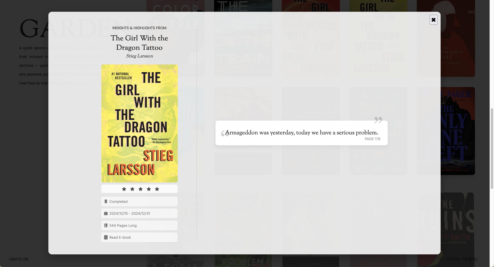

<div align="center">
  <h1>commonplace</h1>
  <p>
    
    
    
  </p>
  
  Built with [11ty (Eleventy)](https://www.11ty.dev/).

  [](https://app.netlify.com/projects/chibi-garden/deploys)


  <p>A cozy and stylish digital bookshelf for tracking, reviewing, and showcasing all your reads.</p>
</div>


---

## 🧑‍💻 Author

Created with love (and a bit of anxiety) by [hellogaray](https://github.com/hellogaray/).  
Feel free to use it for personal purposes, contribute improvements, or ask questions via the [GitHub repository](https://github.com/hellogaray/commonplace).

---

## ✨ Features

- Minimal and responsive layout
- Dynamic quote sections per book
- Custom thumbnail for each book stat
- Markdown-driven content generation
- Modular component design (`header`, `footer`, `thumbnails`)
- CMS support with Netlify Identity / Decap CMS
- Easily update with from GitHub
- Ready for Netlify deployment

---

## 🔧 Tech Stack

- Site Generator: [11ty](https://www.11ty.dev)
- Frontend: [HTML](https://developer.mozilla.org/en-US/docs/Learn_web_development/Getting_started/Your_first_website/Creating_the_content) and [JavaScript](https://developer.mozilla.org/en-US/docs/Web/JavaScript/Guide/Introduction)
- Animations: [CSS](https://www.w3schools.com/Css/) and [GSAP](https://gsap.com/)
- Nunjucks templating
- Markdown for content
- Local assets (covers, CSS)

---

## 💻 Coding Resources

- [W3Schools](https://www.w3schools.com/)
- [freeCodeCamp - Responsive Web Design](https://www.freecodecamp.org/learn/2022/responsive-web-design/)
- [MDN Web Docs](https://developer.mozilla.org/en-US/)
- [11ty for Beginners - Kevin Powell](https://www.youtube.com/watch?v=4wD00RT6d-g&list=PLwhCq3ZFGOGgZDg_pnVh15gUfYqWnlWRs)

---

## 🚀 Installation & Deployment Guide

I recommend using [11ty for Beginners - Kevin Powell](https://www.youtube.com/watch?v=4wD00RT6d-g&list=PLwhCq3ZFGOGgZDg_pnVh15gUfYqWnlWRs) to get everything set up. Is easy to follow and if this is your first time using 11ty it will give you a basic undertanding on how to create your own site, which in turn will make using and customizing this kit easier for you. 

### Prerequisites

* Node.js (v18+ recommended)
* npm (comes with Node)

### 1. Clone the Repository

```bash
git clone https://github.com/YOUR_USERNAME/YOUR_REPO.git
cd YOUR_REPO
```

### 2. Install Dependencies

```bash
npm install
```

### 3. Run the Development Server

```bash
npm run start
```

Or:

```bash
npx @11ty/eleventy --serve
```

Visit: `http://localhost:8080/`

### 4. Build the Site

```bash
npm run build
```

Output is generated in:

```
_site/
```

### 5. Push to GitHub

```bash
git add .
git commit -m "Initial commit"
git branch -M main
git remote add origin https://github.com/YOUR_USERNAME/YOUR_REPO.git
git push -u origin main
```

### 6. Deploy to Netlify

#### One-Click Deployment

Go to [Netlify Start](https://app.netlify.com/start) → Choose GitHub → Select repo → Deploy

#### Manual Setup

* Build command: `npm run build`
* Publish directory: `_site`

Netlify builds and publishes your site automatically.

## ✏️ 7. CMS (Decap / Netlify CMS)

If you include `/admin/`:

1. Enable **Netlify Identity** in your site settings
2. Enable **Git Gateway**
3. Add yourself as an Identity user

Access the CMS:

```
https://YOUR_SITE.netlify.app/admin/
```

You can now:

* Add or edit books
* Upload cover images
* Manage metadata
* Edit quotes

Changes commit directly to GitHub.

## 📁 8. Project Structure

```
.
├── src/
│   ├── _data/               # Title, Description and User
│   ├── admin/               # CMS config
│   ├── books/               # Markdown book files
│   ├── _includes/           # Components (header, footer, thumbnails)
│   ├── css/                 # Styles
│   ├── index.njk            # Homepage
│   ├── rating/              # Rating pages
│   └── ...
├── .eleventy.js             # Eleventy config
├── package.json
├── netlify.toml             # Netlify settings (optional)
└── README.md
```

## 🔧 9. Updating Dependencies

```bash
npm update
```

Or update Eleventy directly:

```bash
npm install @11ty/eleventy@latest
```

## 🧼 10. Clearing Eleventy Cache

```bash
npx @11ty/eleventy --clean
```

## 🖼️ Screenshots

**Book Page**


**Night Mode**


# 🎉 Done!

Your Book Highlights & Insights bookshelf is now:

✔ Installed locally
✔ Connected to GitHub
✔ Automatically deployed to Netlify
✔ Editable through the CMS
